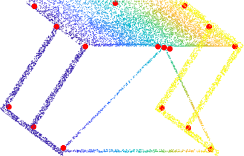
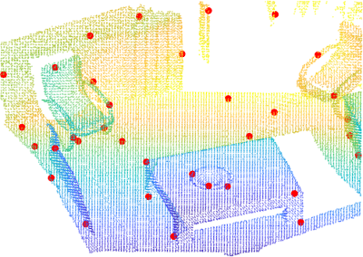
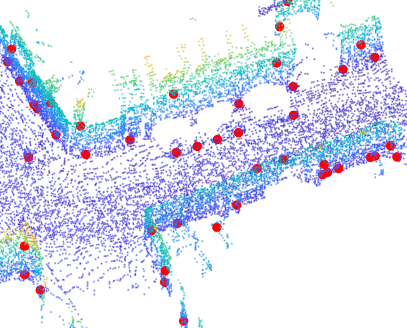
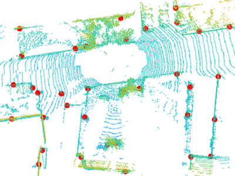

# USIP
[**USIP: Unsupervised Stable Interest Point Detection from 3D Point Clouds.**](https://arxiv.org/abs/1904.00229) ICCV 2019, 
Seoul, Korea <br/>
[Jiaxin Li](https://www.jiaxinli.me/), [Gim Hee Lee](https://sites.google.com/site/gimheelee/) <br/>
Department of Computer Science, National University of Singapore

```
@article{li2019usip,
  title={USIP: Unsupervised Stable Interest Point Detection from 3D Point Clouds},
  author={Li, Jiaxin and Lee, Gim Hee},
  journal={arXiv preprint arXiv:1904.00229},
  year={2019}(
}
```

## 介绍
USIP 检测器：一种无监督的稳定关键点检测器，可以在任意变换下从 3D 点云中检测高度可重复且准确定位的关键点。

USIP 检测到的关键点示例分别如下所示，分别用于 ``ModelNet40、Redwood、Oxford RobotCar、KITTI``







## 使用
环境：
- Python 3
- [PyTorch 1.1 or higher](http://pytorch.org/)
- [visdom](https://github.com/facebookresearch/visdom)
- 编译自定义cuda模块-index_max：
```
cd models/index_max_ext
python setup.py install
#如果出现导入index_max错误，需要将该包卸载重新执行，或者需要重新建立新的环境
```
- 编译自定义cuda模块-ball_query：
```
cd models/ball_query_ext
python3 setup.py install
```
- **可以不需要此步骤**。PCL 点云关键点检测器的 Python 包装器：ISS、Harris3D、SIFT3D: https://github.com/lijx10/PCLKeypoints
```
python3 setup.py install
#下载码源，进行安装。如果出现编译错误，检查CMakeLists.txt中的PCL版本
```


## 数据集
使用``modelnet40``数据为例。格式为``x, y, z, normal_x, normal_y, normal_z``.(``x, y, z, x法向量, y法向量,z法向量``)且归一化，这里的点个数为``10000``。

1.将点云中心移动到坐标原点，并将所有点的坐标的绝对值限制在``1``以内
```
def change_scale(data):
    #移动中心
    xyz_min = np.min(data[:,0:3],axis=0)
    xyz_max = np.max(data[:,0:3],axis=0)
    xyz_move = xyz_min+(xyz_max-xyz_min)/2
    data[:,0:3] = data[:,0:3]-xyz_move
    #绝对值在1以内
    scale = np.max(data[:,0:3])
    data[:,0:3] = data[:,0:3]/scale
    return data
```
2.降采样，目的是将每个点云文件点进行规范化到固定的点数，我们采用随机采样的方式。当然如果有好的想法，采样的方式是可以按照需求进行改进
```
def sample_data(data, num_sample):
    """
        如果 N > num_sample, 随机保留.
        如果 N < num_sample, 随机复制.
    """
    N = data.shape[0]
    if (N == num_sample):
        return data, range(N)
    elif (N > num_sample):
        sample = np.random.choice(N, num_sample)
        return data[sample, ...], sample
    else:
        sample = np.random.choice(N, num_sample-N)
        dup_data = data[sample, ...]
        return np.concatenate([data, dup_data], 0), list(range(N))+list(sample)
```

3.随机按比例划分训练验证集，保存成``.npy``格式

    import numpy as np 
    
    b=np.array([[1,2,3],[4,5,6]]) `
    
    np.save('a.npy',a)

## 训练

在``modelnet``文件夹下包含配置脚本``ooptions_detector.py``和培训脚本``train_detector.py``。请在运行训练脚本之前修改配置文件。例如，您可能需要修改``--dataset、--dataroot、--gpu_ids``的默认值。

## 测试
运行 ``evaluation/save_keypoints.py``脚本得到保存的关键点的信息（``x、y、z``）

``--root：需要测试的文件``

``--output_folder：保存npy的文件``

``--desired_keypoint_num：输出的关键点个数``

使用``visdom``进行可视化。实时绘制各种损失值和重建的点云。请在训练前启动``visdom``服务器，否则会出现警告/错误。
```
python -m visdom.server
```
可视化结果可以在浏览器中查看，地址为：
```
http://localhost:8097
```
